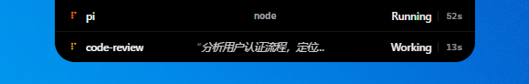
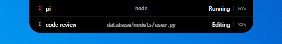
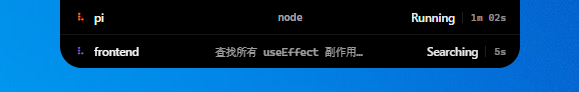
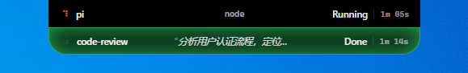
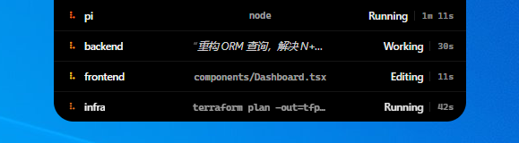

# 灵动岛 (Dynamic Island) for Claude Code · **Windows**

一个 Claude Code 的 **skill**，在屏幕顶部显示桌面级灵动岛风格的状态胶囊，实时展示 Claude Code 当前工作状态。

- **Windows**: 屏幕顶部居中胶囊，WinForms + WebView2

## 效果预览

当 Claude Code 工作时，屏幕顶部会出现一个半透明的黑色胶囊，显示当前操作状态（如"正在读取文件..."、"执行命令中..."等）；完成后保留为 Done 状态，直到下一次操作把它覆盖。

### 状态一览

| 状态 | 截图 |
|------|------|
| **Working** — 思考/分析中，琥珀色 spinner |  |
| **Reading** — 正在读取文件，蓝色 spinner + 文件路径 |  |
| **Editing** — 正在修改文件，黄色 spinner + 文件路径 |  |
| **Running** — 执行命令，橙色 spinner + 命令内容 |  |
| **Searching** — 搜索代码，紫色 spinner |  |
| **Done** — 完成，绿色外发光 |  |
| **等待确认** — 等待用户输入，琥珀色脉冲发光 |  |

### 多会话并行

多个 Claude Code 实例同时工作时，胶囊会堆叠显示，每行独立追踪各自的状态和耗时：



## 安装

将此 skill 目录放置到 `~/.claude/skills/island/`，然后在 Claude Code 中输入：

```
/island setup
```

Agent 会自动完成环境检查、依赖安装、编译和 hooks 配置。

> **在 WSL2 里运行 Claude Code？同样可用。** 灵动岛窗口只在 **Windows 桌面**渲染，但驱动它的 Claude Code 既可跑在 Windows 原生终端、也可跑在 **WSL2**。区别只在 hooks 命令调用哪个 node：Windows 原生用 `node`；WSL2 则换成 `node.exe`（Windows 的 node，WSL interop 可直接调用并原样透传 stdin），bridge 路径用 `C:/…` 形式，例如 `node.exe C:/Users/<你>/.../island/src/bridge.mjs hook`。代价：每个 hook 多一次 interop 冷启动开销；其余行为（多会话堆叠、状态更新）与纯 Windows 一致。

## 依赖

| 依赖 | 用途 | 安装方式 |
|------|------|---------|
| **Node.js** | 运行所有 JS 脚本 | Claude Code 自带 |
| **.NET Desktop Runtime 8.0+** | Windows：运行预编译 exe | `winget install Microsoft.DotNet.DesktopRuntime.8` |
| **WebView2 Runtime** | Windows：渲染胶囊 HTML | Windows 10+ 已内置 |

预编译 exe 已内置在 `src/hosts/windows/` 目录中，绝大多数用户无需安装编译工具。

## 命令

| 命令 | 说明 |
|------|------|
| `/island setup` | 首次初始化，自动配置环境与 hooks |
| `/island on` | 显示灵动岛 |
| `/island off` | 隐藏灵动岛 |
| `/island toggle` | 切换显示/隐藏 |
| `/island scale <small\|medium\|large\|xlarge>` | 调整大小 |
| `/island screen <primary\|active\|all\|1\|2\|...>` | 选择屏幕（`all` = 每块屏幕各一个胶囊） |
| `/island theme <dark\|pink\|auto>` | 切换主题（暗色 / 马卡龙粉 / 跟随系统） |
| `/island reload` | 重启灵动岛 |
| `/island kill` | 完全关闭 |
| `/island status` | 查看状态 |

## 架构

```
Claude Code hooks (settings.json)
  ↓ SessionStart / UserPromptSubmit / PreToolUse / PostToolUse / Stop / StopFailure / PermissionRequest
bridge.mjs  (一次性进程，每次 hook 调用)
  ↓ Named pipe
companion.mjs  (常驻守护进程)
  ↓ stdin/stdout JSON-line 协议
原生窗口 (C# WebView2)
  └─ 渲染透明背景黑色胶囊 HTML
```

## 行为

- **自动启动**: Claude Code 启动时灵动岛自动出现
- **状态保留**: done / interrupted / waiting 等状态行保留到该会话下一个事件覆盖（不再定时自动移除）
- **多会话**: 每个 Claude Code 实例独立显示
- **永久常驻**: companion 不会自动退出，需手动 `/island kill`
- **重启恢复**: 电脑重启后下次打开 Claude Code 自动恢复
- **主题切换**: 支持 `dark` / `pink` / `auto` 三种主题（`/island theme`），偏好持久化到 `~/.claude/claude-island.json`

## 故障排查

详见 `SKILL.md` 中的故障排查章节，或输入 `/island status` 查看运行状态。

## 更新日志

历次维护新增 / 删减的内容见 [CHANGELOG.md](CHANGELOG.md)。

## 许可

MIT
